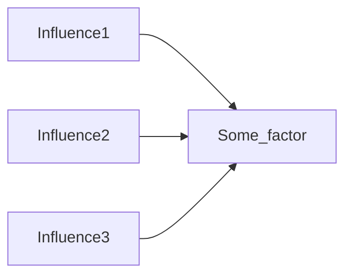
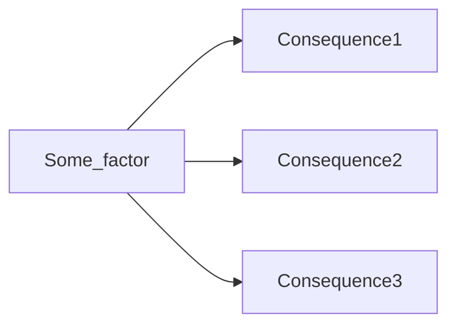

# Causal pathways: when is a pathway not just a link?

Thanks guys, there's lots to like here and lots to agree with. Helping to find what causal hypotheses to focus on... What do you have to say about _pathways_ as opposed to individual links/mechanisms? If we called this approach "quality and rigour in causal mechanisms evaluation" would that miss anything?  
Disclaimer: for me, the logic around how links might combine into pathways and what that means for evaluation, that's the most exciting part. e.g. how might this intervention influence an outcome which might be multiple steps downstream of it?

Megan Shoji on cp coffee chat today 3/7/2025, getting ppl to rate the evidence for the whole pathway vs evidence for particular hotspots.

We've been honoured to be part of the Causal Pathways initiative since 2021, it's been really great to network with these evaluation experts, and we've learned and benefitted a lot. 

As someone interested not only in the content of causal pathways work but also its logical underpinnings, I'm really glad to have Tom Aston and Marina Apgar's "How do we define and support quality and rigor in Causal Pathways evaluation?" (Apgar & Aston, 2025)as a go-to guide for this: Alongside (Lynn et al., 2021) I think it's the main Causal Pathways text. 

BUT I think there is still something essential which is missing from Causal Pathways thinking as it currently stands. 

Why do we talk about causal pathways (and causal networks and diagrams and maps) rather than just listing *individual links*: separate, hypothesised, cause/effect relationships?

What is it about the logic of causal *networks* which we are leveraging, or at least implying, when talking about causal pathways? Do we have guidance on how to assemble evidence for A --> C on the basis of evidence for A --> B and B --> C?

### Assembling evidence to make evaluative judgements about *individual links*

One thing we do often do is query the network to answer questions like: what are the various influences on factor F.

-or what are its various consequences.

Evaluation literature 

Occasionally we also mention network measures like centrality. 

Looking at Marina and Tom's causal pathways "Questions" (for the CP training - below) - they never really talk about the fundamental property and challenge of a causal _map_ which is **transitivity** or **tracing**. From a-->b and b --> c concluding, (maybe, but when and how?), a --> c. They just never address the question.  But if you weren't interested in this fundamental property & challenge, why would you use a map or talk about a pathway??Causal questions that fit within this overarching question may focus on exploring causal pathways or on assessing impact. Apgar and Aston categorize them as follows and provide the following examples:  

Aston and Apgar list "all possible types of causal questions." (Apgar & Aston, 2025, p. 16)

I've marked with ✅ those which I believe can be reasonably answered through a "single link" lens

**Causal Process** Questions:  
✅ What specific processes led to the observed outcomes?  
✅ How did the intervention trigger change?  
✅ What intermediate mechanisms connect the intervention to outcomes?  
  
**Causal Context** Questions:  
✅ How do different contexts modify the causal mechanism?  
✅ What contextual conditions enable or inhibit causal effects?  
✅ How do local factors interact with intervention strategies?  
  
**Emergent Causality** Questions:  
➖How do unintended consequences emerge?  
❓What unexpected causal pathways developed?  
✅ How do multiple factors interact to produce outcomes?  
  
**Comparative Causal** Questions:  
❓ Which intervention strategy was most effective in creating change?  
❓ How do different approaches compare in terms of causal impact?  
❓ What are the differential effects of alternative interventions?  
  
**Equity Focused** Questions:  
➖ How did causal effects differ across social groups?  
➖ What variations in impact existed?  
➖ Did the intervention affect different populations differently?  
  
**Systemic Causality** Questions:  
➖ How did the intervention contribute to systemic changes?  
➖ What broader transformations were triggered?  
➖ How do multiple levels of the system interact causally?  
  
**Impact Contribution and Inquiry** Questions:  
➖ To what extent did the intervention cause the observed changes?  
➖ What difference did the program make compared to doing nothing?  
➖ How much of the observed outcome can be directly attributed to the intervention?

"The practice of critical reasoning in causal analysis involves:  Identifying causal hypotheses and interrogating each step within a causal chain"

## Transitivity, Janus

There are at least three problems of transitivity which we need to think about
- Given that A influences B and B influences C, does A influence C?
- Given that P believes that A influences B and P believes that B influences C, does P believe that A influence C?
- Given that someone believes that A influences B and someone else P believes that B influences C, does someone (who? we? the people?) believe that A influence C?
-